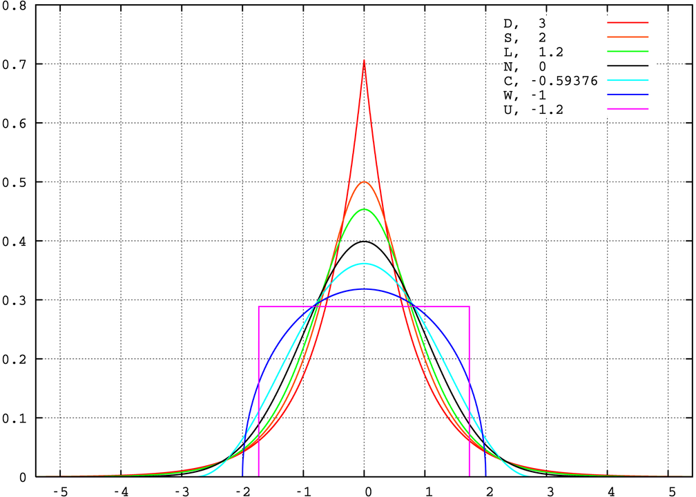

```{r, echo = FALSE, comment = NULL}
library(formattable)
library(ggplot2)
enprecosp <- read.table("data/enprecosp_2011.txt", header = TRUE, sep = "|")
```

# Medidas de resumen

## Medidas de posición

Las medidas de posición nos van a dar información acerca de diferentes localizaciones de los datos en una variables. Pueden ser **centrales**, como la *media*, la *mediana* y la *moda*. O **no centrales**, como los **cuartiles** y **percentiles**.

### Proporción
Es una **frecuencia relativa**. Vimos varios ejemplos de proporciones cuando realizamos las tablas de distribución de frecuencia en el Capítulo \@ref(frec). Calculemos la proporción de personas que alguna vez en la vida consumieron marihuana.

```{r}
## Proporción de personas que consumieron marihuana alguna vez en la vida (PV_MA)
marihuana <- enprecosp$PV_MA
marihuana <- factor(marihuana,
                    labels = c("Sí", "No")
                    )

p <- prop.table(table(marihuana))
p
```

Entonces, el `r percent(p[1], dec = ",")` de los encuestados consumió alguna vez marihuana en la vida.

### Moda
Es el valor de la variable que más se repite. Es el valor de la variable que tenga la frecuencia más alta.

```{r}
## En el periodo en que usted consumía marihuana con
## mayor frecuencia ¿cada cuánto consumía?
fconsumo <- enprecosp$BIMA04
fconsumo <- factor(fconsumo,
                   levels = c(1:6, 9),
                   labels = c("Casi todos los días",
                              "3 0 4 días a la semana",
                              "1 o 2 días a la semana",
                              "De 1 a 3 días al mes",
                              "Menos de una vez al mes",
                              "Una sola vez",
                              "Ns/Nc"))

## Calculamos las frecuencias absolutas
p <- table(fconsumo)
p

## Buscamos el valor con la frecuencia máxima
which.max(p)
```

### Mediana
Es el valor de la variable que deja por debajo y por arriba, el 50% de los casos. Podemos calcularla a partir de variables de **nivel ordinal**. La podemos observar a partir de las frecuencias relativas acumuladas. Continuando con la frecuencia de consumo de marihuana

```{r}
## En el periodo en que usted consumía marihuana con
## mayor frecuencia ¿cada cuánto consumía?
fconsumo <- enprecosp$BIMA04

## Excluimos el valor 9, Ns/Nc
fconsumo <- factor(fconsumo,
                   levels = c(6:1),
                   labels = c("Una sola vez",
                              "Menos de una vez al mes",
                              "De 1 a 3 días al mes",
                              "1 o 2 días a la semana",
                              "3 o 4 días a la semana",
                              "Casi todos los días"
                              ),
                   ordered = TRUE)

## Frecuencias absolutas
frec <- table(fconsumo)
## Frecuencias relativas
frel <- prop.table(frec)
## Frecuencias relativas acumuladas
cumfrel <- cumsum(frel)
cumfrel
```

El primer valor que supera 0.5 es la mediana. En este caso, la mediana es *menos de una vez al mes*.

### Cuartiles y percentiles

Los cuartiles dividen al conjunto de datos en 4. El primer cuartil (**1Q**) es el valor de la variable que deja por debajo el 25% de los casos. El tercer cuartil (**3er cuartil**) es el valor de la variable que deja por debajo el 75% de los casos. El segundo cuartil (**2Q**) es el valor que deja por debajo el 25% de los casos. Es la **mediana**.  
Si dividimos a la distribución de datos en 100, obtenemos los **percentiles**. El **percentil r** es el valor de la variable que deja el r por ciento de los casos por debajo de él.
Utilicemos estas medidas para comparar la edad de inicio de consumo de alcohol, tabaco y marihuana.

```{r}
## Seleccionamos las variables de edad de inicio de consumo
## para tabaco, alcohol y marihuana
edad_tabaco <- enprecosp$BITA03[enprecosp$BITA03 != 99]
edad_alcohol <- enprecosp$BIBA03[enprecosp$BIBA03 != 99]
edad_marihuana <- enprecosp$BIMA03[enprecosp$BIMA03 != 99]

## Calculamos los cuantiles
quantile(edad_tabaco, na.rm = TRUE)
quantile(edad_alcohol, na.rm = TRUE)
quantile(edad_marihuana, na.rm = TRUE)

## Calculamos los percentiles 5 y 95
quantile(edad_tabaco, c(0.05, 0.95), na.rm = TRUE)
quantile(edad_alcohol, c(0.05, 0.95), na.rm = TRUE)
quantile(edad_marihuana, c(0.05, 0.95), na.rm = TRUE)
```

### Media

Es el promedio. Se obtiene sumando todos los datos y dividiendo por el número de casos.

$$
\bar{x} = \frac{\displaystyle \sum_{i=1}^n x_i}{n}
$$
La media, a diferencia de la mediana, es sensible a valores extremos. Observemos un ejemplo.

```{r}
## Cantidad de miembros en el hogar
nhogar <- enprecosp$CNTDDCOMP
range(nhogar)

## Graficamos
hist(nhogar)

## Calculamos las medidas de resumen
sum(nhogar)/length(nhogar)
mean(nhogar)
median(nhogar)
```


## Medidas de dispersión

Son medidas que nos indican el grado de agrupación de los datos

### Rango o recorrido

Es la distancia entre el valor máximo y el valor mínimo.

$$
R = x_{n} - x_{1}
$$
Donde:  
$x_n$ es el valor máximo  
$x_1$ es el valor mínimo

```{r}
## Veamos cual es el rango de la variables cantidad de miembros del hogar
nhogar <- enprecosp$CNTDDCOMP
range(nhogar)

## Rango para cantidad de habitaciones del hogar
nhabitaciones <- enprecosp$BHHO02
range(nhabitaciones)
```

También son de utilidad el **rango o recorrido intercuartilar** y el **rango o recorrido semi-intercuartilar**.  
El **rango o recorrido intercuartilar** se simboliza con AIQ y es la distancia entre el tercer y el primer cuartil.
El **rango o recorrido intercuartilar** se simboliza con SRIC y es la mitad del AIQ.
Calulemos estas distancias para el tiempo de consumo de tabaco, alcohol y marihuana.

```{r}
## Seleccionamos las variables de edad de inicio de consumo
## para tabaco, alcohol y marihuana
edad_tabaco <- enprecosp$BITA03[enprecosp$BITA03 != 99]
edad_alcohol <- enprecosp$BIBA03[enprecosp$BIBA03 != 99]
edad_marihuana <- enprecosp$BIMA03[enprecosp$BIMA03 != 99]

## Calculamos los cuantiles
q_tabaco <- quantile(edad_tabaco, na.rm = TRUE)
q_alcohol <- quantile(edad_alcohol, na.rm = TRUE)
q_marihuana <- quantile(edad_marihuana, na.rm = TRUE)

## Calculamos el rango intercuartilar
aiq_t <- q_tabaco[4] - q_tabaco[2]; aiq_t
aiq_al <- q_alcohol[4] - q_alcohol[2]; aiq_al
aiq_ma <- q_marihuana[4] - q_marihuana[2]; aiq_ma

## Calculamos el rango semi-itercuartilar
aiq_t/2
aiq_al/2
aiq_ma/2
```

### Varianza y desvío estándar

Una de las medidas más utilizadas para medir la variabilidad cuando los datos son cuantitativos es la varianza ($s^2$) y el desvío estándar ($s$).

Sea n la cantidad de casos. La **varianza** es la suma de los cuadrados de los desvíos con respecto a la media, dividido por n - 1.

$$
s^2 = \frac{\sum_{i=1}^n (x_i - \bar{x})^2}{n - 1}
$$
El **desvío estándar** es la raíz cuadrada de la varianza.

$$
s = \sqrt{s^2}
$$
```{r}
## Calculemos la varianza para los edad de
## Inicio de consumo de tabaco
## Quitamos los valores faltantes
edad_tabaco <- edad_tabaco[!is.na(edad_tabaco)]

## Calculo la varianza
n <- length(edad_tabaco)
xn <- mean(edad_tabaco)
s2 <- sum((edad_tabaco - xn)^2) / (n - 1); s2

## Desvío estándar
sqrt(s2)

## Utilizando la función sd
var(edad_tabaco)
sd(edad_tabaco)

## Calculamos sd para alcohol y marihuana
sd(edad_alcohol, na.rm = TRUE)
sd(edad_marihuana, na.rm = TRUE)
```

La varianza y el desvío estandar dependen de la unidad de medida que se utilice. Por ejemplo, la varianza de la edad de inicio de consumo de alcohol se mide en años al cuadrado. Y el desvío en años. Ello hace que la medida sea diferente si utilizamos escalas diferentes. Imaginemos que medimos el peso de un grupo de personas en gramos y en kilos. La varianza, para ese grupo de personas, medida en $gramos^2$ será más grande que cuando la midamos en $kilos^2$.  
A veces, incluso, nos interesa comparar magnitudes diferentes, por ejemplo, peso y altura, y comparar la varianza de ambas variables.
Para poder interpretar más facilmente el desvío estandar en términos relativos se utiliza el **coeficiente de variación** (CV)

$$
CV = \frac{s}{\bar{x}} * 100
$$
El coeficiente de variación es adimensional y me permite comparar el desvío estandar en términos de porcentajes.


```{r}
sd(edad_tabaco) / mean (edad_tabaco) * 100
sd(edad_marihuana, na.rm = TRUE) / mean(edad_marihuana, na.rm = TRUE) * 100
```

### Varibilidad en variables cualitativas

Para medir la variabilidad en variables cualitatiativas podemos hacer uso de coefientes de incertidumbre. La idea es que mientras más concentrados estén los datos en una categoría, tendrán menor incertidumbre o menor variabilidad. Mientras estén repartidos más equitativamente, entonces tendremos mayor incertidumbre o mayor variabilidad. 

Una medida útil en estos casos en la H de @shanon1949mathematical.

$$
H(x) = -\sum_{i = 1}^k f_i' * log_2 (f_i')
$$
Utilizando este coeficiente, comparemos la viariabilidad para hombres y para mujeres de: ¿Cuán fácil o difícil le sería conseguir tranquilizantes sin indicación médica? (EnPreCoSP)

```{r}
## Seleccionamos las variables
facil_tranq <- enprecosp$BIAC07_01
sexo <- enprecosp$BHCH04

## Convertimos a factor
facil_tranq <- factor(facil_tranq, 
                      labels = c("Me sería fácil",
                                 "Me sería difícil",
                                 "No podría consegir",
                                 "Ns/Nc"))

sexo <- factor(sexo,
              labels = c("Varón",
                         "Mujer"))

## Calculamos las frecuencias relativas por sexo
tab <- prop.table(table(facil_tranq, sexo), 2); tab

phombre <- tab[,1]
pmujer <- tab[,2]


## Calculamos el coeficiente de incertidumbre
-sum(phombre * log2(phombre))
-sum(pmujer * log2(pmujer))
```

## Medidas de forma

Con la librería `e1071` podemos calcular la simetría y la curtosis de una distribución.

```{r}
library(e1071)

## Seleccionamos la edad y la guardamos en una nueva variable
edad <- enprecosp$BHCH05
## Simetría
skewness(edad, na.rm = TRUE)
## Curtosis
kurtosis(edad, na.rm = TRUE)

```


La distribución normal es un concepto teórico que nos permite aproximar el comportamiento de una gran cantidad de variables. Existe una definición matemática precisa de la distribución normal. Por ahora, nos conformaremos con saber que la distribución normal tiene una forma acampanada.

```{r}
ggplot(data.frame(x = 0), aes(x = x)) +
    stat_function(fun = dnorm, col = "black", size = 1) +
    xlim(c(-3, 3)) +
    theme_minimal() +
    theme(
        axis.text = element_blank(),
        axis.ticks = element_blank()) +
    labs(x = NULL, y = NULL)
```

Dos medidas comunmente utilizadas son la asimetría y la curtosis. La **kurtosis** mide que tan coludas son las distribuciones con respecto a la normal. El 0 representa una distribución normal. Valores positivos son distribuciones más coludas (con más valores extremos) y valores negativos distribuciones menos coludas.

```{r out.width = '75%', fig.align="center"}

```

* Un índice entre -0.5 y 0.5 indica que la distribución es mesocúrtica.
* Un índice mayor a 0.5 insdica que la distribución es leptocúrtica
* Un índice menor a -0.5 indica que la distribución es platicúrtica

```{r echo = FALSE}

## Semicírculo
semicirculo <- function(x){
    2/(pi*2^2) * sqrt(2^2 - x^2)
}

ggplot(data.frame(x = 0), aes(x = x)) +
    stat_function(fun = dnorm, aes(color = "Mesocúrtica(Normal)"), size = 1) +
    stat_function(fun = dt, args = list(df = 1), aes(color = "Leptocúrtica"), size = 1) +
    stat_function(fun = semicirculo, xlim = c(-2, 2), aes(color = "Platicúrtica"), size = 1) +
    xlim(-3, 3) +
    scale_color_manual("Kurtosis", values = c("tomato", "black", "lightblue")) +
    theme_minimal() +
    theme(
        axis.text = element_blank(),
        axis.ticks = element_blank()) +
    labs(x = NULL, y = NULL)

```

## Estandarización

La estandarización mediante los procesos de **centrado** y **escalado** de los datos. Para centrar los datos, les restamos la media. Para escalarlos, los dividimos por su desvío estándar.

```{r}

## Seleccionamos la edad y la guardamos en una nueva variable
edad <- enprecosp$BHCH05

## Centramos
edad_centrada <- edad - mean(edad)

## Escalamos
edad_estandarizada <- edad_centrada / sd(edad)

head(edad)
head(edad_estandarizada)
```

Los puntajes estandarizados, también llamados **puntajes z**, son adimensionales. Esa transformación es útil para comparar a los individuos con su grupo de referencia, y detectar, por ejemplo, valores extremos. Al ser una medida relativa, también nos sirve para comparar a un individuo en diferentes variables.  
Veremos posteriormente que, en las distribuciones normales, aproximadamente el 95% de los casos se encuentra entre -2 y 2 desvíos estandar. Por lo tanto, encontrar individuos con puntajes z mayores a 2 o menores a -2 nos indica que son más bien casos atípicos.

