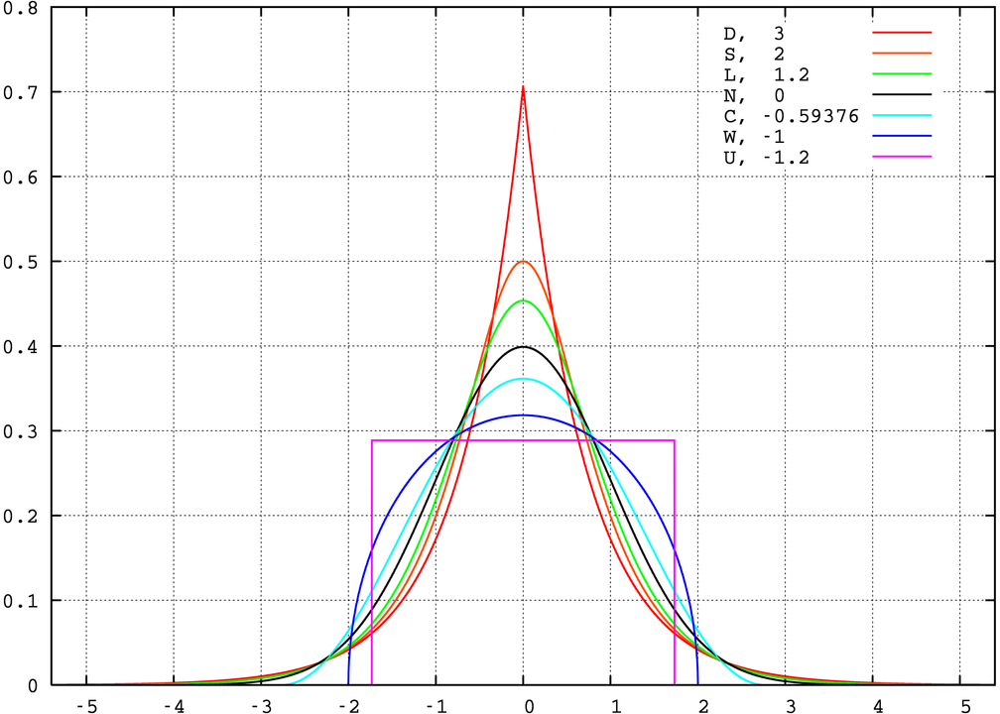

--- 
title: "Introducción al Análisis de Datos"
author: "Matías Alfonso"
date: "`r Sys.Date()`"
site: bookdown::bookdown_site
output: bookdown::gitbook
documentclass: book
bibliography: [book.bib, packages.bib]
biblio-style: apalike
link-citations: yes
github-repo: https://github.com/mentoldo/introduccion_analisis_datos
description: "This is a minimal example of using the bookdown package to write a book. The output format for this example is bookdown::gitbook."
lang: es
---

# (PART) Programación en R {-}

# Preliminares {#prelim}

R es un lenguaje de programación desarrollado inicialmente por Ross Ihaka y Robert Gentleman en el departamento de Estadística de la Universidad de Auckland en 1993. Está orientado específicamente con un enfoque al análisis estadístico.  
R se desarrolla a partir de un lenguaje denominado S, desarrollado por John Chambers en 1976, disponible a partir del software comercial S-PLUS.  
Es un lenguaje interactivo, permite la ejecución de instrucciónes en líneas de comando en una consola. 

## ¿Por qué R?

R puede ser ejecutado en múltiples plataformas y en la gran mayoría de los sistemas operativos. Puede ser ejecutado en tablets, teléfonos o computadoras.
La utilización de scripts permite compartir fácilmente los análisis con los colegas, así como asegurar la reproductibilidad de los resultados. Todo lo que realizamos mediante una interfaz gráfica con el mouse no deja registros de nuestro trabajo e impide que podamos repasar nuestro trabajo para corregir errores.  
La versatilidad y la potencia que otorga un lenguaje de programación es mucho mayor que la que podemos obtener con softwares estadísticos de interfaz gráfica.   
La comunidad de usuarios y desarrolladores de R está en constante crecimiento en los últimos años. Hay una enorme cantidad de gente realizando nuevos desarrollos en R cada día, que están a la vanguardia de la ciencia computacional y estadística.

## Software Libre

La mayor ventaja que tiene R con respecto a otros softwares de análisis estadístico es que es un software libre. ¿Qué quiere decir eso? Por un lado, que es gratuito. Por otro, que el código fuente con el que R fue desarrollado está abierto, se puede descargar y está diponible online.
Actualmente el copyrigth de R lo posee la [R Foundation](https://www.r-project.org/foundation/). R forma parte del [sistema GNU](https://es.wikipedia.org/wiki/GNU), desarrollado por la [Free Software Foundation](https://es.wikipedia.org/wiki/Free_Software_Foundation). De acuerdo a la Free Software Foundation, con el software libre se garantizan cuatro libertades fundamentales:

* La libertad de ejecutar el programa para cualquier propósito. (Libertad 0)
* La libertad de estudiar cómo el programa funciona y adaptarlo a tus propias necesidades. (Libertad 1)
* La libertad de redistribuir copias de manera que puedas ayudar a alguien. (Libertad 2)
* La libertad de mejorar el programa, y liberar tus mejoras al público, de manera que se beneficie toda la comunidad. (Libertad 3)

## Sistema de Paquetes

El sistema de funcionalidades de R se encuentra agrupado en paquetes. La mayor parte de los paquetes se encuentran disponibles en [Comprehensive R Archive Network (CRAN)](https://cran.r-project.org/). Hay un conjunto de paquetes principales, de base, que incluye todos los paquetes que se instalan por defecto cuando instalamos R.
Luego, tenemos un montón de paquetes con funcionalidades específicas que podemos instalar en función de nuestras necesidades.

```{r include=FALSE}
# automatically create a bib database for R packages
knitr::write_bib(c(
  .packages(), 'bookdown', 'knitr', 'rmarkdown'
), 'packages.bib')
```

<!--chapter:end:index.Rmd-->

# Primeros pasos

## Asignación de datos y evaluación.

R es un *lenguaje interpretado*. Esto quiere decir que le podemos ir pasando instrucciones y el programama las irá interpretando. Cuando ejecutamos el programa, nos encontramos con el prompt a la espera de intrucciones:

```
>
```

Una de las operaciones más sencillas que podemos realizar es la asignación de valores a las variables. El operador de asignación es `<-`.

```{r}
x <- 1
print(x)
x
texto <- "hola mundo"
texto
```

Podemos imprimir el valor de una variable con la función `print()` o directamente escribiendo la variable.

Tenemos dos formas de interactuar con R:

- Tipear directamente los comandos en el prompt y ejecutarlos.
- Escribir un archivo de texto con todas las intrucciones y luego ejecutarlo. Este archivo se denomina script.

## Working directory

Lo primero que debemos hacer cuando comenzamos a trabajar en R es configurar el directorio de trabajo. Una buena costumbre es crear un directorio nuevo de trabajo cuando comenzamos un proyecto nuevo. Luego configuramos esa carpeta como directorio de trabajo. Colocamos allí todos los archivos vinculados a ese proyecto. Para determinar en qué directorio estamos parados, podemos utilizar el comando `getwd()`. Para configurar el directorio de trabajo, utilizamos

```
setwd(#RUTA-A-DIRECTORIO)
```

## Comentarios

Todo lo que escribamos luego de un `#` en una intrucción, no será evaluado.

```{r}
x <- c(3, 4, 5)
## Esto no se ejecuta

x
```

Ello nos permite comentar el código que escribimos, a manera de documentación.

## Objetos básicos en R

Casi todo lo que encontremos en R, se denominan *objetos*. Hay 5 tipos de objetos básicos o atómicos:

* lógico
* numérico
* entero
* complejo
* caracter

Veamos algunos ejemplos:

```{r}
## Logico
TRUE
FALSE

## Numérico
c(1.509, 2.859)

## Enteros
1:10

## Caracter
"casa"
```

Existen muchos más clases de objetos en R. Para averiguar de que tipo es un objeto, podemos utilizar la función `class()`

```{r}
x <- 1:10
class(x)

class("TRUE")
```

Para preguntar por la clase de un objeto, podemos utilizar el comando `class()`

```{r}
x <- 1:10
class(x)

y <- "casa"
class(y)
```

## Factores
Los factores son básicamente objetos de clase entero, pero con etiquetas. Son datos categóricos y pueden estar ordenados o no.

```{r}
f <- factor(c("si", "si", "no", "si"))
f

f <- factor(c("bajo", "bajo", "medio", "alto"),
            levels = c("bajo", "medio", "alto"),
            ordered = TRUE)
f
```


## Cómo buscar ayuda

R tiene un sistema de ayuda integrado. Si queremos saber para qué sirve un comando determinado o como pasarle los argumentos, podemos utilizar `?` o `help()`. Supongamos que queremos saber cómo se utiliza la función `sum()`

```{r}
help(sum)

?vector
```


<!--chapter:end:02-introduccion.Rmd-->

# Estructuras de datos

## Vectores

La forma más elemental de almacenar datos en R es en un vector. Un **vector** es una concatenación de objetos del mismo tipo. Podemos utilizar la función `c()` para crear vectores.

```{r}
x <- c(1, 2, 3, 2.5)
x <- c(TRUE, FALSE)
x <- c(T, F)
x <- c("casa", "árbol", "patio")

## También podemos utilizar la función vector.
x <- vector(mode = "numeric", length = 10)
```

Si concatenamos elementos de diferente clase, R realizará una coerción automática de la clase de los objetos.

```{r}
x <- c("casa", 2) ## character
x <- c(TRUE, 2) ## numeric

class(x)
```

## Listas

Las listas también son una concatenación de elementos, pero pueden contener elementos de diferente clase. Para crear una lista, podemos utilizar `list()`

```{r}
x <- list("peso", 2, "altura", 3, TRUE)
x
```

## Matrices
Las matrices son vectores, pero con un atributo de dimensión. La dimensión en sí es un vector de enteros de largo 2.

```{r}
m <- matrix(1:9, nrow = 3)
m

dim(m)
```

Al igual que los vectores, contienen objetos de la misma clase. Las matrices tienen algunas propiedades matemáticas interesantes, pues se pueden realizar operaciones especiales con ellas, por ejemplo, se pueden sumar o multiplicar.


## Data frames

Los data frames son datos tabulados. Son tablas, donde cada columna puede ser de una clase diferente. Es un objeto particularmente útil para el análisis estadístico.

```{r}
data.frame(Id = c(1, 2, 3),
           Nombre = c("Juan", "Carlos", "Ramona"),
           Altura = c(1.76, 1.80, 1.65))

```


## Valores faltantes
Existen dos tipos de valores faltantes en R:  

* `NA`
* `NaN`

<!--chapter:end:03-estruc_datos.Rmd-->

# Obteniendo datos

Existen una enorme cantidad de funciones para abrir archivos de diversos tipos.

## Datos tabulares

Un formato estándar y abierto para guardar información en forma de tablas son archivos separados por comas (.csv)
Para leer estos datos podemos utilizar:  

* `read.tables()`
* `read.csv()`

Podemos descargar la base de datos del Titanic del siguiente link [titanic.csv](../data/titanic.csv). Descargamos y colocamos el archivo en una carpeta `data`, dentro del directorio de trabajo:

```{r}
## Leemos los datos desde un archivo y los guardamos en la variable base
base <- read.csv("data/titanic.csv")

## Imprimimos las primeras 5 filas de la base
head(base)[, 1:3]

```

También podemos leer datos directamente de la web

```{r}
## Datos Abiertos
## Cantidad de consultas médicas y odontológicas en centros de Salud del Primer nivel 2003 - 2019.
consultas <- read.csv("http://datos.salud.gob.ar/dataset/5fcacd04-58eb-4b43-89a0-55231c58f1b4/resource/ed9e418f-9858-44df-8ce7-a74fde738684/download/consultas-medicamentos-esenciales.csv")


head(consultas)

## Recetas de medicamentos escenciales 2003-2019
recetas <- read.csv("http://datos.salud.gob.ar/dataset/dff3bf69-3514-42a3-a2aa-041495895ab2/resource/3b1a2d9e-ac15-484c-aacf-3f3ce79729af/download/recetas-medicamentos-esenciales.csv")
```

### Excel

Podemos leer archivos Excel importando la librería `readxl`

```{r}
library(readxl)

## Excel
memoria <- read_xls("./data/EXP1.xls")

head(memoria)[1:3]
```


<!--chapter:end:04-obteniendo_datos.Rmd-->

# Operaciones básicas

## Subsetting. Selección de elementos.

Podemos seleccionar elementos o subconjuntos específicos de un objeto de R. Hay diferentes operadores: `[`, `[[`, `$`

### Vectores
```{r}
## Creamos un vector con las primeras 10 letras del abecedario.
letras <- letters[1:10]
letras

## Por posición
letras[2]
letras[2:3]
```

Si los elementos están etiquetados, podemos recuperar los elementos del vector por sus nombres.

```{r}
peso <- c(Juan = 70, Pedro = 85, Ramona = 65)
peso["Juan"]
peso[c("Juan", "Ramona")]
```

También podemos utilizar un vector lógico para recuperar elementos de un vector.

```{r}
condicion <- peso > 68
condicion
peso[condicion]
```


### Matrices
```{r}
matriz <- matrix(letters[1:9], nrow = 3)

## Indicamos el índice de fila y columna.
matriz[1, 2]

matriz[2:3, 1:2]
```

### Listas

```{r}
lista <- list(Nombre = c("Juan", "Pedro", "Ramona"),
              Peso = c(70, 85, 65),
              Altura = c(1.70, 1.78, 1.65))


## Podemos recuperar los elementos por posición o por nombre

## Devuelve un objeto lista
lista[1]
lista["Nombre"]


## Devuelve la clase del objeto seleccionado
lista[[1]]
lista[["Nombre"]]
lista$Nombre
```

### Data frames


```{r}
df <- as.data.frame(lista)
df
df[1,]
df[,1]
df$Nombre
df[["Nombre"]]
df[1:2, 1:2]
```

## Operaciones vectorizadas

Podemos realizar operaciones elemento a elemento en los vectores.

```{r}
x <- 1:10
y <- 15:6
x + y
x * y
x / y
```
También podemos realizar operaciones lógicas.

```{r}
x == y
x < y
x > y
```


<!--chapter:end:05-operaciones_basicas.Rmd-->

# Estructuras de control

Las estructuras de control son condiciones lógicas que nos permiten controlar el flujo de ejecución del código. 

* if / else
* while
* for

## If / else

El `if`. Es el **condicional**. Si la condición es verdadera, ejecuto el código. Si no, salteo esa porción de código. Si queremos que dada la condición de `Falso` el programa realize algo en particular podemos utilizar la sentencia `else`.


```{r}
x <- 5

if(is.integer(x)){
  "x es entero"
} else {
  "x no es entero"
}

if(is.numeric(x)){
  "x es entero"
}
```

## `while`

Realiza un loop mientras la condición sea verdadera.

```{r}
x <- 1

## Le sumo 1 a x. Repito condición haste que x llege a 10
while(x < 10){
  x <- x + 1
  print(x)
}

x <- 1


## Idem utilizando un while y un if
while(TRUE){
  if(x < 10){
    x <- x + 1
    print(x)
    next
  } else {
    break
  }
}

```

## `for`

Realiza una operación para una secuencia de objetos

```{r}
letras <- letters[1:10]

for(i in letras){
  print(i)
}

for(i in 1:length(letras)){
  print(letras[i])
}

```


<!--chapter:end:06-estructuras_de_control.Rmd-->

# Funciones

Hasta ahora hemos venido utilizando varias funciones. Las funciones nos permiten encapsular el código, facilitan la lectura y ahorran trabajo. Si tenemos que ejecutar el mismo código más de dos veces, probablemente convenga definir una funcion.


```{r}
## Definimos una función que calcula la media
media <- function(x){
  sum(x)/length(x)
}
media(1:10)


## Definimos una función que no devuelve ningún valor, pero imprime un
## mensaje en pantalla
holaMundo <- function(){
  print("Hola Mundo!")
}
holaMundo()

## Definimos una función que toma dos character y los une, separados por un -
unir <- function(a, b){
  paste(a, b, sep = '-')
}
unir("A", "B")

class(unir)
```


<!--chapter:end:07-funciones.Rmd-->

# (PART) Introducción al análisis estadístico {-}

# Introducción

La estadística sirve para resumir la información cuando trabajamos con muchos datos. Podemos hacer una división entre:

* Estadística descriptiva  
* Estadística inferencial

En la **estadística descriptiva** abordaremos diferentes técnicas que nos permitan resumir un conjunto de datos datos. Cuando trabajemos con **estadística inferencial**, intentaremos estimar parámetros o medidas de variables de una **población** a partir de una **muestra**.


## Datos primarios y secundarios

* **Datos primarios**: Es el registro primitivo de la información. Son tablas de doble entrada en el que cada **fila** representa una **unidad de observación** y cada **columna** una **variable**.

* **Datos secundarios**: Implican algún procesamiento de los datos primarios. Podemos incluir aquí las tablas de distribución de frecuencia y las tablas cruzadas o tablas de contingencia.

## Resumen de la información

Resumiremos la infomación a través de:

* Tablas
* Gráficos
* Medidas de resumen (estadísticos).

<!--chapter:end:101-introduccion.Rmd-->

# Bases de datos

Para trabajar en las siguientes unidades haremos uso de las siguientes bases de datos:  

## EnPreCoSP
Base de Datos de consumo de sustancias psicoactivas. Indec
Disponible en: "https://www.indec.gob.ar/ftp/cuadros/menusuperior/enprecosp/bases_enprecosp2011.rar"

Agregar un '|' en la última columna de la primer file para poder leerlo correctamente. Datos corregidos: 

Base corregida: [enprecosp](data/enprecosp_2011.txt)

```{r}
enprecosp <- read.table("data/enprecosp_2011.txt", header = TRUE, sep = "|")
```

## Memoria

Base de memoria. [experimento](data/EXP1.xls)

## Titanic

[Titanic](data/titanic.csv)

## Base prácticos

[Prácticos](data/base2019.txt)

## CEPRAM

[Base](data/cepram.csv)
[Libro de Códigos](data/cuestionario/CEPRAM_libro_codigo.pdf)


<!--chapter:end:102-bases_de_datos.Rmd-->

```{r, echo = FALSE, comment = NULL}
enprecosp <- read.table("data/enprecosp_2011.txt", header = TRUE, sep = "|")
```

# Distribuciones de frecuencia {#frec}

## Definiciones
**Frecuencias absolutas simples**. Es la cantidad de casos que asumen determinado valor de variable.

**Frecuencias relativas simples**. Es la proporción de cases que asumen determinado valor.

**Frecuencias absolutas acumuladas**. Es la cantidad de casos que asumen determinado valor o valores inferiores a el.

**Frecuencias relativas acumuladas**. Es la proporción de casos que asumen determinado valor o valores inferiores a el.

## Aplicaciones
Trabajemos con la ENPreCoSP. Veamos como es el estado de salud general subjetiva de la población y construyamos una tabla de distribución de frecuencias para la variable `BISG01` (En general, ¿usted diría que su salud es...)

```{r}
## Seleccionamos la nueva variable y la guardamos en una nueva variable
saludsub <- enprecosp$BISG01

## Vemos cuantos casos tenemos en total
length(saludsub)

## Convertimos a factor y etiquetamos los códigos de valores
saludsub <- factor(saludsub,
                   labels = c("Excelente", "Muy buena", "Buena", "Regular", "Mala"),
                   ordered = TRUE)

## Calculamos las frecuencias absolutas simples
f <- table(saludsub)

## Calculamos las frecuencias relativas simples
frel <- prop.table(f)

## Calculamos las frecuencias absolutas acumuladas
fcum <- cumsum(f)

## Calculamos las frecuencias relativas acumuladas
frelcum <- cumsum(frel)

## Juntamos todo y armamos una tabla de distribución de freucuencias.
cbind(f, fcum, frel,frelcum)
```

Ahora analicemos las variables `BISG02` (Ha sufrido algún accidente el útlimo años) y `BISG03` (Ha sufrido alguna enfermedad el último año)

```{r}
## Seleccionamos BISG02 y la guardamos en una nueva variable
accidente <- enprecosp$BISG02
enfermedad <- enprecosp$BISG03

## Convertimos a factor y etiquetamos los códigos de valores
accidente <- factor(accidente,
                   labels = c("Sí", "No", "Ns/Nc"))
enfermedad <- factor(enfermedad,
                   labels = c("Sí", "No", "Ns/Nc"))

## Construimos las frecuencias para la variable accidente
f <- table(accidente)
frel <- prop.table(f)

## Juntamos todo y armamos una tabla de distribución de freucuencias.
cbind(f, frel)

## Construimos las frecuencias para la variable enfermedad
f <- table(enfermedad)
frel <- prop.table(f)

## Juntamos todo y armamos una tabla de distribución de freucuencias.
cbind(f, frel)
```

Veamos comos está conformada la edad de la muestra (`BHCH05`). Como es una variable continua, primero debemos construir los intervalos de clase.

```{r}
## Seleccionamos la edad y la guardamos en una nueva variable
edad <- enprecosp$BHCH05

## Veamos los valores mínimos y máximos para la edad
range(edad)
edad_reco <- cut(edad, breaks = c(16, 24, 34, 49, 65), include.lowest = TRUE)

## Realizamos la tabla de distribución de frecuencias igual que anteriormente
f <- table(edad_reco)
frel <- prop.table(f)
fcum <- cumsum(f)
frelcum <- cumsum(frel)

## Juntamos todo y armamos una tabla de distribución de freucuencias.
cbind(f, fcum, frel,frelcum)

```


## Actividades


<!-- # Operaciones básicas -->

<!-- Comencemos calculando una proporción. Supongamos que realizamos 10 mediciones para la variables rendimiento escolar. La variable puede tomar tres valores: bajo, medio y alto. -->

<!-- ```{r} -->
<!-- rendimiento <- c(1, 3, 1, 2, 2, 1, 2, 2, 3, 2) -->

<!-- rendimiento <- factor(rendimiento, -->
<!--                       labels = c("bajo", "medio", "alto"), -->
<!--                       ordered = TRUE) -->

<!-- rendimiento -->
<!-- ``` -->


<!--chapter:end:103-distribución_frecuencia.Rmd-->

```{r, echo = FALSE, comment = NULL}
enprecosp <- read.table("data/enprecosp_2011.txt", header = TRUE, sep = "|")
```

# Gráficos de frecuencias

## Histogramas

El histograma es una buena manera de observar la distribución de los datos en **variables contínuas**. Realicemos algunos gráficos para las variables trabajadas en el Capítulo \@ref(frec). Veamos como de distribuye la edad de la muestra. Para realizar un histograma, podemos utilizar la función `hist`

```{r}
## Seleccionamos la edad y la guardamos en una nueva variable
edad <- enprecosp$BHCH05

## Realizamos un histograma.
hist(edad)
```

También podemos representar las frecuencias relativas o los porcentajes.

```{r}
## Realizamos un histograma con las frecuencias relativas
library(lattice)
histogram(edad,
          breaks = 10,
          ylab = "Porcentaje del Total")

## Cambiamos el número de barras. Agregamos color
hist(as.numeric(edad),
     col = "seagreen")

## Estilamos el gráfico
hist(as.numeric(edad),
     axes = FALSE,
     main = "Histograma para edad",
     xlab = "Edad",
     ylab = "Frecuencia",
     # col = "steelblue",
     xlim = c(10,70),
     ylim = c(0, 5000),
     col = rainbow(5))
axis(1, pos = 0)
axis(2, pos = 10)
```

## Gráfico de barras

El gráfico de barras nos permite visualizar las frecuencias en **variables cualitativas**. Para realizar un gráfico de barras podemo utilizar la función `barplot`

```{r}
## Seleccionamos BISG02 y la guardamos en una nueva variable
accidente <- enprecosp$BISG02

## Convertimos a factor y etiquetamos los códigos de valores
accidente <- factor(accidente,
                   labels = c("Sí", "No", "Ns/Nc"))
## Construimos las frecuencias para la variable accidente
f <- table(accidente)
frel <- prop.table(f)

## Juntamos todo y armamos una tabla de distribución de freucuencias.
dfreq <- cbind(f, frel)

barplot(dfreq[,1],
        col = "steelblue")
```

## Gráfico de tortas
Los gráficos de tortas también nos permiten graficar frecuencias. Los gráficos de torta están actualmente desaconsejados. Se aconseja en su lugar el uso de gráfico de barras. Los gráficos de barras permiten visualizar más facilemente las diferencias de proporciones que los gráficos de barras, particularmente cuando representamos más de dos proporciones. Para ver una revisión acerca de la discusión de gráficos de barras y de torta vea @spence2005no. Para realizar un gráfico de tortas, podemos utilizar la función `pie`

```{r}
## Seleccionamos BISG02 y la guardamos en una nueva variable
accidente <- enprecosp$BISG02

## Convertimos a factor y etiquetamos los códigos de valores
accidente <- factor(accidente,
                   labels = c("Sí", "No", "Ns/Nc"))
## Construimos las frecuencias para la variable accidente
f <- table(accidente)
frel <- prop.table(f)

pie(frel)
```

Estilamos el gráfico. Agregamos los porcentajes.

```{r}
## Cargamos librería para formatear los porcentajes
library(formattable)

## Guardamos la tabla con porcentajes en una nueva variables
porcentaje <- percent(frel, digits = 2, dec = ",")

## Construimos las etiquetas
etiq <- paste(names(porcentaje),"; " , round(porcentaje, 4), sep = "")

pie(porcentaje,
    labels = etiq,
    radius = 1,
    col = c("tomato", "whitesmoke", "violetred")
    )
```

## Ojiva de Galton

La ojiva de Galton nos permite graficar las **frecuencias relativas acumuladas** y buscar **percentiles** y **cuantiles empíricos**. Veamos como se distribuye la edad de inicio de consumo de marihuana en la muestra:

```{r}
## Seleccionamos la edad y la guardamos en una nueva variable
## Quito los valores 99, que corresponden a NS/NC
edad <- enprecosp$BIMA03[enprecosp$BIMA03 != 99]

f <- table(edad)
frel <- prop.table(f)
frelcum <- cumsum(frel)

plot(names(frelcum), frelcum,
     type = "s",
     ylab = "F'",
     xlab = "Edad")

## Realizamos un gráfico similar, pero utilizando la función
## distribución acumulada empírica
plot(ecdf(edad),
     main = "Ojiva de Galton",
     xlab = "Edad")
```


<!--chapter:end:104-graficos_frecuencias.Rmd-->

```{r, echo = FALSE, comment = NULL}
library(formattable)
library(ggplot2)
enprecosp <- read.table("data/enprecosp_2011.txt", header = TRUE, sep = "|")
```

# Medidas de resumen

## Medidas de posición

Las medidas de posición nos van a dar información acerca de diferentes localizaciones de los datos en una variables. Pueden ser **centrales**, como la *media*, la *mediana* y la *moda*. O **no centrales**, como los **cuartiles** y **percentiles**.

### Proporción
Es una **frecuencia relativa**. Vimos varios ejemplos de proporciones cuando realizamos las tablas de distribución de frecuencia en el Capítulo \@ref(frec). Calculemos la proporción de personas que alguna vez en la vida consumieron marihuana.

```{r}
## Proporción de personas que consumieron marihuana alguna vez en la vida (PV_MA)
marihuana <- enprecosp$PV_MA
marihuana <- factor(marihuana,
                    labels = c("Sí", "No")
                    )

p <- prop.table(table(marihuana))
p
```

Entonces, el `r percent(p[1], dec = ",")` de los encuestados consumió alguna vez marihuana en la vida.

### Moda
Es el valor de la variable que más se repite. Es el valor de la variable que tenga la frecuencia más alta.

```{r}
## En el periodo en que usted consumía marihuana con
## mayor frecuencia ¿cada cuánto consumía?
fconsumo <- enprecosp$BIMA04
fconsumo <- factor(fconsumo,
                   levels = c(1:6, 9),
                   labels = c("Casi todos los días",
                              "3 0 4 días a la semana",
                              "1 o 2 días a la semana",
                              "De 1 a 3 días al mes",
                              "Menos de una vez al mes",
                              "Una sola vez",
                              "Ns/Nc"))

## Calculamos las frecuencias absolutas
p <- table(fconsumo)
p

## Buscamos el valor con la frecuencia máxima
which.max(p)
```

### Mediana
Es el valor de la variable que deja por debajo y por arriba, el 50% de los casos. Podemos calcularla a partir de variables de **nivel ordinal**. La podemos observar a partir de las frecuencias relativas acumuladas. Continuando con la frecuencia de consumo de marihuana

```{r}
## En el periodo en que usted consumía marihuana con
## mayor frecuencia ¿cada cuánto consumía?
fconsumo <- enprecosp$BIMA04

## Excluimos el valor 9, Ns/Nc
fconsumo <- factor(fconsumo,
                   levels = c(6:1),
                   labels = c("Una sola vez",
                              "Menos de una vez al mes",
                              "De 1 a 3 días al mes",
                              "1 o 2 días a la semana",
                              "3 o 4 días a la semana",
                              "Casi todos los días"
                              ),
                   ordered = TRUE)

## Frecuencias absolutas
frec <- table(fconsumo)
## Frecuencias relativas
frel <- prop.table(frec)
## Frecuencias relativas acumuladas
cumfrel <- cumsum(frel)
cumfrel
```

El primer valor que supera 0.5 es la mediana. En este caso, la mediana es *menos de una vez al mes*.

### Cuartiles y percentiles

Los cuartiles dividen al conjunto de datos en 4. El primer cuartil (**1Q**) es el valor de la variable que deja por debajo el 25% de los casos. El tercer cuartil (**3er cuartil**) es el valor de la variable que deja por debajo el 75% de los casos. El segundo cuartil (**2Q**) es el valor que deja por debajo el 25% de los casos. Es la **mediana**.  
Si dividimos a la distribución de datos en 100, obtenemos los **percentiles**. El **percentil r** es el valor de la variable que deja el r por ciento de los casos por debajo de él.
Utilicemos estas medidas para comparar la edad de inicio de consumo de alcohol, tabaco y marihuana.

```{r}
## Seleccionamos las variables de edad de inicio de consumo
## para tabaco, alcohol y marihuana
edad_tabaco <- enprecosp$BITA03[enprecosp$BITA03 != 99]
edad_alcohol <- enprecosp$BIBA03[enprecosp$BIBA03 != 99]
edad_marihuana <- enprecosp$BIMA03[enprecosp$BIMA03 != 99]

## Calculamos los cuantiles
quantile(edad_tabaco, na.rm = TRUE)
quantile(edad_alcohol, na.rm = TRUE)
quantile(edad_marihuana, na.rm = TRUE)

## Calculamos los percentiles 5 y 95
quantile(edad_tabaco, c(0.05, 0.95), na.rm = TRUE)
quantile(edad_alcohol, c(0.05, 0.95), na.rm = TRUE)
quantile(edad_marihuana, c(0.05, 0.95), na.rm = TRUE)
```

### Media

Es el promedio. Se obtiene sumando todos los datos y dividiendo por el número de casos.

$$
\bar{x} = \frac{\displaystyle \sum_{i=1}^n x_i}{n}
$$
La media, a diferencia de la mediana, es sensible a valores extremos. Observemos un ejemplo.

```{r}
## Cantidad de miembros en el hogar
nhogar <- enprecosp$CNTDDCOMP
range(nhogar)

## Graficamos
hist(nhogar)

## Calculamos las medidas de resumen
sum(nhogar)/length(nhogar)
mean(nhogar)
median(nhogar)
```


## Medidas de dispersión

Son medidas que nos indican el grado de agrupación de los datos

### Rango o recorrido

Es la distancia entre el valor máximo y el valor mínimo.

$$
R = x_{n} - x_{1}
$$
Donde:  
$x_n$ es el valor máximo  
$x_1$ es el valor mínimo

```{r}
## Veamos cual es el rango de la variables cantidad de miembros del hogar
nhogar <- enprecosp$CNTDDCOMP
range(nhogar)

## Rango para cantidad de habitaciones del hogar
nhabitaciones <- enprecosp$BHHO02
range(nhabitaciones)
```

También son de utilidad el **rango o recorrido intercuartilar** y el **rango o recorrido semi-intercuartilar**.  
El **rango o recorrido intercuartilar** se simboliza con AIQ y es la distancia entre el tercer y el primer cuartil.
El **rango o recorrido intercuartilar** se simboliza con SRIC y es la mitad del AIQ.
Calulemos estas distancias para el tiempo de consumo de tabaco, alcohol y marihuana.

```{r}
## Seleccionamos las variables de edad de inicio de consumo
## para tabaco, alcohol y marihuana
edad_tabaco <- enprecosp$BITA03[enprecosp$BITA03 != 99]
edad_alcohol <- enprecosp$BIBA03[enprecosp$BIBA03 != 99]
edad_marihuana <- enprecosp$BIMA03[enprecosp$BIMA03 != 99]

## Calculamos los cuantiles
q_tabaco <- quantile(edad_tabaco, na.rm = TRUE)
q_alcohol <- quantile(edad_alcohol, na.rm = TRUE)
q_marihuana <- quantile(edad_marihuana, na.rm = TRUE)

## Calculamos el rango intercuartilar
aiq_t <- q_tabaco[4] - q_tabaco[2]; aiq_t
aiq_al <- q_alcohol[4] - q_alcohol[2]; aiq_al
aiq_ma <- q_marihuana[4] - q_marihuana[2]; aiq_ma

## Calculamos el rango semi-itercuartilar
aiq_t/2
aiq_al/2
aiq_ma/2
```

### Varianza y desvío estándar

Una de las medidas más utilizadas para medir la variabilidad cuando los datos son cuantitativos es la varianza ($s^2$) y el desvío estándar ($s$).

Sea n la cantidad de casos. La **varianza** es la suma de los cuadrados de los desvíos con respecto a la media, dividido por n - 1.

$$
s^2 = \frac{\sum_{i=1}^n (x_i - \bar{x})^2}{n - 1}
$$
El **desvío estándar** es la raíz cuadrada de la varianza.

$$
s = \sqrt{s^2}
$$
```{r}
## Calculemos la varianza para los edad de
## Inicio de consumo de tabaco
## Quitamos los valores faltantes
edad_tabaco <- edad_tabaco[!is.na(edad_tabaco)]

## Calculo la varianza
n <- length(edad_tabaco)
xn <- mean(edad_tabaco)
s2 <- sum((edad_tabaco - xn)^2) / (n - 1); s2

## Desvío estándar
sqrt(s2)

## Utilizando la función sd
var(edad_tabaco)
sd(edad_tabaco)

## Calculamos sd para alcohol y marihuana
sd(edad_alcohol, na.rm = TRUE)
sd(edad_marihuana, na.rm = TRUE)
```

La varianza y el desvío estandar dependen de la unidad de medida que se utilice. Por ejemplo, la varianza de la edad de inicio de consumo de alcohol se mide en años al cuadrado. Y el desvío en años. Ello hace que la medida sea diferente si utilizamos escalas diferentes. Imaginemos que medimos el peso de un grupo de personas en gramos y en kilos. La varianza, para ese grupo de personas, medida en $gramos^2$ será más grande que cuando la midamos en $kilos^2$.  
A veces, incluso, nos interesa comparar magnitudes diferentes, por ejemplo, peso y altura, y comparar la varianza de ambas variables.
Para poder interpretar más facilmente el desvío estandar en términos relativos se utiliza el **coeficiente de variación** (CV)

$$
CV = \frac{s}{\bar{x}} * 100
$$
El coeficiente de variación es adimensional y me permite comparar el desvío estandar en términos de porcentajes.


```{r}
sd(edad_tabaco) / mean (edad_tabaco) * 100
sd(edad_marihuana, na.rm = TRUE) / mean(edad_marihuana, na.rm = TRUE) * 100
```

### Varibilidad en variables cualitativas

Para medir la variabilidad en variables cualitatiativas podemos hacer uso de coefientes de incertidumbre. La idea es que mientras más concentrados estén los datos en una categoría, tendrán menor incertidumbre o menor variabilidad. Mientras estén repartidos más equitativamente, entonces tendremos mayor incertidumbre o mayor variabilidad. 

Una medida útil en estos casos en la H de @shanon1949mathematical.

$$
H(x) = -\sum_{i = 1}^k f_i' * log_2 (f_i')
$$
Utilizando este coeficiente, comparemos la viariabilidad para hombres y para mujeres de: ¿Cuán fácil o difícil le sería conseguir tranquilizantes sin indicación médica? (EnPreCoSP)

```{r}
## Seleccionamos las variables
facil_tranq <- enprecosp$BIAC07_01
sexo <- enprecosp$BHCH04

## Convertimos a factor
facil_tranq <- factor(facil_tranq, 
                      labels = c("Me sería fácil",
                                 "Me sería difícil",
                                 "No podría consegir",
                                 "Ns/Nc"))

sexo <- factor(sexo,
              labels = c("Varón",
                         "Mujer"))

## Calculamos las frecuencias relativas por sexo
tab <- prop.table(table(facil_tranq, sexo), 2); tab

phombre <- tab[,1]
pmujer <- tab[,2]


## Calculamos el coeficiente de incertidumbre
-sum(phombre * log2(phombre))
-sum(pmujer * log2(pmujer))
```

## Medidas de forma

Con la librería `e1071` podemos calcular la simetría y la curtosis de una distribución.

```{r}
library(e1071)

## Seleccionamos la edad y la guardamos en una nueva variable
edad <- enprecosp$BHCH05
## Simetría
skewness(edad, na.rm = TRUE)
## Curtosis
kurtosis(edad, na.rm = TRUE)

```


La distribución normal es un concepto teórico que nos permite aproximar el comportamiento de una gran cantidad de variables. Existe una definición matemática precisa de la distribución normal. Por ahora, nos conformaremos con saber que la distribución normal tiene una forma acampanada.

```{r}
ggplot(data.frame(x = 0), aes(x = x)) +
    stat_function(fun = dnorm, col = "black", size = 1) +
    xlim(c(-3, 3)) +
    theme_minimal() +
    theme(
        axis.text = element_blank(),
        axis.ticks = element_blank()) +
    labs(x = NULL, y = NULL)
```

Dos medidas comunmente utilizadas son la asimetría y la curtosis. La **kurtosis** mide que tan coludas son las distribuciones con respecto a la normal. El 0 representa una distribución normal. Valores positivos son distribuciones más coludas (con más valores extremos) y valores negativos distribuciones menos coludas.

```{r out.width = '75%', fig.align="center"}

```

* Un índice entre -0.5 y 0.5 indica que la distribución es mesocúrtica.
* Un índice mayor a 0.5 insdica que la distribución es leptocúrtica
* Un índice menor a -0.5 indica que la distribución es platicúrtica

```{r echo = FALSE}

## Semicírculo
semicirculo <- function(x){
    2/(pi*2^2) * sqrt(2^2 - x^2)
}

ggplot(data.frame(x = 0), aes(x = x)) +
    stat_function(fun = dnorm, aes(color = "Mesocúrtica(Normal)"), size = 1) +
    stat_function(fun = dt, args = list(df = 1), aes(color = "Leptocúrtica"), size = 1) +
    stat_function(fun = semicirculo, xlim = c(-2, 2), aes(color = "Platicúrtica"), size = 1) +
    xlim(-3, 3) +
    scale_color_manual("Kurtosis", values = c("tomato", "black", "lightblue")) +
    theme_minimal() +
    theme(
        axis.text = element_blank(),
        axis.ticks = element_blank()) +
    labs(x = NULL, y = NULL)

```

## Estandarización

La estandarización mediante los procesos de **centrado** y **escalado** de los datos. Para centrar los datos, les restamos la media. Para escalarlos, los dividimos por su desvío estándar.

```{r}

## Seleccionamos la edad y la guardamos en una nueva variable
edad <- enprecosp$BHCH05

## Centramos
edad_centrada <- edad - mean(edad)

## Escalamos
edad_estandarizada <- edad_centrada / sd(edad)

head(edad)
head(edad_estandarizada)
```

Los puntajes estandarizados, también llamados **puntajes z**, son adimensionales. Esa transformación es útil para comparar a los individuos con su grupo de referencia, y detectar, por ejemplo, valores extremos. Al ser una medida relativa, también nos sirve para comparar a un individuo en diferentes variables.  
Veremos posteriormente que, en las distribuciones normales, aproximadamente el 95% de los casos se encuentra entre -2 y 2 desvíos estandar. Por lo tanto, encontrar individuos con puntajes z mayores a 2 o menores a -2 nos indica que son más bien casos atípicos.


<!--chapter:end:105-medidas_resumen.Rmd-->

```{r, echo = FALSE, comment = NULL}
library(formattable)
enprecosp <- read.table("data/enprecosp_2011.txt", header = TRUE, sep = "|")
```
# Gráficos de Resumen

## Gráficos de barras

Los gráficos de barras también sirven para graficar las medias. También podemos agregar las 
```{r, message=FALSE, echo = TRUE}
library(Hmisc)
```


```{r}
## Seleccionamos las variables de edad de inicio de consumo
## para tabaco, alcohol y marihuana
edad_tabaco <- enprecosp$BITA03[enprecosp$BITA03 != 99]
edad_alcohol <- enprecosp$BIBA03[enprecosp$BIBA03 != 99]
edad_marihuana <- enprecosp$BIMA03[enprecosp$BIMA03 != 99]

## Calculamos la media y el desvío estandar
res_tabaco <- c(mean(edad_tabaco, na.rm = TRUE), sd(edad_tabaco, na.rm = TRUE))
res_alcohol <- c(mean(edad_alcohol, na.rm = TRUE), sd(edad_alcohol, na.rm = TRUE))
res_marihuana <- c(mean(edad_marihuana, na.rm = TRUE), sd(edad_marihuana, na.rm = TRUE))

## Construimos una matriz con los resultados
m <- cbind(res_tabaco, res_alcohol, res_marihuana)

## Armamos el gráfico de barras
b <- barplot(m[1,], ylim = c(0, 25), col = "steelblue")
# errbar(colnames(m), m[1,], m[1,] + m[2,], m[1,] - m[2,])
arrows(b, m[1,] - m[2,], b, m[1,] + m[2,], length=0.05, angle=90, code=3)


# x <- factor(c("tabaco", "alcohol", "marihuana"))
# medias <- c(mean(edad_tabaco, na.rm = TRUE),
#             mean(edad_alcohol, na.rm = TRUE),
#             mean(edad_alcohol, na.rm = TRUE))
# sd <- c(sd(edad_tabaco, na.rm = TRUE),
#         sd(edad_alcohol, na.rm = TRUE),
#         sd(edad_alcohol, na.rm = TRUE))
# 
# barplot(height = medias, width = 1, col = "steelblue")

```

## Gráficos de caja

```{r}
boxplot(list(edad_tabaco, edad_alcohol, edad_marihuana),
        names = c("tabaco", "alcohol", "marihuana"),
        col = "tomato",
        pch = 16)
```


<!--chapter:end:106-graficos_resumen.Rmd-->

```{r, echo = FALSE, comment = NULL}
library(formattable)
library(kableExtra)
library(dplyr)
enprecosp <- read.table("data/enprecosp_2011.txt", header = TRUE, sep = "|")
```
# Relaciones entre variables

Hasta aquí hemos venidos trabjando principalmente con medidas de resúmenes, tablas y gráficos para variables individuales. Muchas veces interesa obervar como las variables se comportan conjuntamente. Para ello, también haremos uso de tablas, gráficos y medidas de resúmenes.
En términos técnicos, lo que nos interesesa es explicar la variabilidad. Podemos explicar parcialmente la variabilidad de una variable conociendo los valores de otras variables que estén **asociadas**.
Diremos que existe **asociación de variables** cuando la variación de una de ellas influya en la variación de las otras. Por ejemplo, el peso y la altura son dos variables que están asociadas. Esperaríamos que las personas que son más altas sean, en promedio, mas pesadas que aquellas que son más bajas.
Diremos que dos variables son **independientes** cuando la variación de una de ellas no afecta la variación de la otra.


## Tablas de contingencia
Son llamadas también **tablas de distribución conjunta**, **tablas bivariadas** o **tablas cruzadas**. Permite obervar la relación entre variables cualitativas. Se representan las categorías de una variables en las filas, y las categorías de la otra en las columnas, y se pueden calcular diferentes tipos de frecuencias absolutas o relativas.

Supongamos que queremos observar la relación entre la prevalencia de consumo con el riesgo percibido para el consumo frecuente de alcohol (BIBA14_02).

```{r}
## Prevalencia de consumo del último mes y riesgo percibido
## Alcohol
riesgo_perc <- factor(enprecosp$BIBA14_02,
                      labels = c("Ningún riesgo",
                                 "Riesgo leve o moderado",
                                 "Gran riesgo",
                                 "No sé que riesgo corre"))


prev_mes <- factor(enprecosp$P1M_BA,
                labels = c("Sí",
                           "No"))

## Realizamos una tabla de frecuencias absolutas conjunta
tc <- table(riesgo_perc, prev_mes)
tc
```

En estas tablas también se pueden expresas las frecuencias marginales. Las **frecuencias marginales** son los totales por fila y por columna. Se corresponden con las frecuencias univariadas para cada una de las variables.

```{r}
## Frecuencias marginales
addmargins(tc)

```


También podemos calcular las frecuencias relativas

```{r}
## Frecuencias relativas al total
tc_tot <- prop.table(tc)
tc_tot <- addmargins(tc_tot)

format(tc_tot, digits = 0, nsmall = 4)

## Frecuencias relativas por filas
tc_fila <- addmargins(tc, 1)
tc_fila <- prop.table(tc_fila, 1)

format(tc_fila, digits = 0, nsmall = 4)

## Frecuencias relativas por columna
tc_col <- addmargins(tc, 2)
tc_col <- prop.table(tc_col, 2)

format(tc_col, digits = 0, nsmall = 4)

```

## Riesgo relativo

|             | Enfermo | Saludable | Total     |
|-------------|---------|-----------|-----------|
|  Expuesto   | $$D_e$$ | $$H_e$$   | $$N_e$$   |
| No Expuesto | $$D_n$$ | $$H_n$$   | $$N_n$$   |


$$
RR = \frac{D_e/N_e}{D_n/N_n}
$$


## Odds ratio
$$
OR = \frac{D_e/H_e}{D_n/H_n}
$$

## Intensidad de la asociación

Las medidas de asociación nos permiten evaluar el grado o intensidad de la relación entre las variables.

### Q de Kendall - Yule
El Q de Kendall-Yule es una medida de intensidad de asociación para variables dicotómicas. 
Supongamos que tenemos la siguiente tabla de doble entrada:  

```{r, echo = FALSE}
tabla <- c("a", "b", "a+b", "c", "d", "c+d", "a+c", "b+d", "n")

tabla <- matrix(tabla,
                nrow = 3,
                byrow = TRUE)


colnames(tabla) <- c("Sí", "No", "Total")
rownames(tabla) <- c("Positiva", "Negativa", "Total")


kable(tabla) %>% 
  kable_styling()
```

El coeficiente de Q es:

$$
Q = \frac{ad - bc}{ad + bc}
$$


Evaluemos si el sexo está relacionado con la prevalencia mensual de consumo de alcohol.

```{r}
sexo <- factor(enprecosp$BHCH04J,
                    labels = c("Varón",
                               "Mujer"))

prev_alcohol <- factor(enprecosp$P1M_BA,
                    labels = c("Sí",
                               "No"))

tc <- table(sexo, prev_alcohol)

tc
## Veamos el grado de asociación
a <- tc[1,1]
b <- tc[1,2]
c <- tc[2,1]
d <- tc[2,2]


## Calculamos el coeficiente Q de Kendall-Yule
Q <- (a*d-b*c)/(a*d+b*c)
Q
```

### Chi cuadrado ($\chi^2$)

```{r}
## Riesgo leve percibido
## En su opinión, ¿cuál cree usted que es el riesgo que
## corre una persona que toma bebidas alcohólicas de vez
## en cuando

riesgo_perc <- factor(enprecosp$BIBA14_01,
                      labels = c("Ningún riesgo",
                                 "Riesgo leve o moderado",
                                 "Gran riesgo",
                                 "No sé qué riesgo"))

# prop.table(table(riesgo_perc))

prev_alcohol <- factor(enprecosp$P1M_BA,
                    labels = c("Sí",
                               "No"))

tc <- table(riesgo_perc, prev_alcohol)

## Calculamos las frecuencias esperadas y observadas
chi <- chisq.test(tc)
chi$observed
chi$expected

chi_val <- chi$statistic; chi_val
```

## Coeficiente Phi de Pearson-Yule ($\varphi$)

$$
\varphi = \sqrt{\frac{\chi^2}{n}}
$$

```{r}
sexo <- factor(enprecosp$BHCH04J,
                    labels = c("Varón",
                               "Mujer"))

prev_alcohol <- factor(enprecosp$P1M_BA,
                    labels = c("Sí",
                               "No"))

tc <- table(sexo, prev_alcohol)

chi <- chisq.test(tc)
chi_val <- chi$statistic

n <- sum(tc)
phi <- sqrt(chi_val/n)
```


### Coeficiente de contingencia C de Pearson
Mide el grado de asociación en tablas de contingencia con más de dos categorías.

$$
C = \sqrt{\frac{\chi^2}{\chi^2 + n}}
$$

Va de 0 a 1 y se compara con un C máximo:

$$
C_{max} = \sqrt{\frac{min(f, c) - 1}{min(f, c)}}
$$
Donde:
$f$ es el número de filas
$g$ es el número de columnas

```{r}
## Riesgo leve percibido
## En su opinión, ¿cuál cree usted que es el riesgo que
## corre una persona que toma bebidas alcohólicas de vez
## en cuando

riesgo_perc <- factor(enprecosp$BIBA14_01,
                      labels = c("Ningún riesgo",
                                 "Riesgo leve o moderado",
                                 "Gran riesgo",
                                 "No sé qué riesgo"))

# prop.table(table(riesgo_perc))

prev_alcohol <- factor(enprecosp$P1M_BA,
                    labels = c("Sí",
                               "No"))

tc <- table(riesgo_perc, prev_alcohol)

## Calculamos las frecuencias esperadas y observadas
chi <- chisq.test(tc)
chi$observed
chi$expected

chi_val <- chi$statistic; chi_val

## Calculamos el C de Pearson
f <- nrow(tc)
c <- ncol(tc)
n <- sum(tc)
C <- sqrt(chi_val/(chi_val + n)); C
Cmax <- sqrt((min(f, c) - 1) / min(f, c)); Cmax
```

### Coeficiente V de Cramer

$$
V = \sqrt{\frac{\chi^2}{n * min(f - 1, c-1)}}
$$
```{r}
V <- sqrt(chi_val/(n * min(ncol(tc), nrow(tc))))
```

<!--chapter:end:107-relaciones_entre_variables.Rmd-->

`r if (knitr:::is_html_output()) '
# References {-}
'`

<!--chapter:end:199-references.Rmd-->

